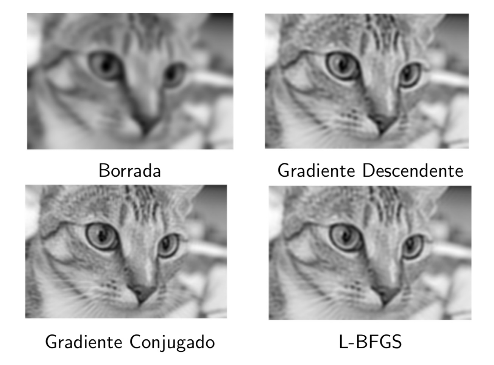
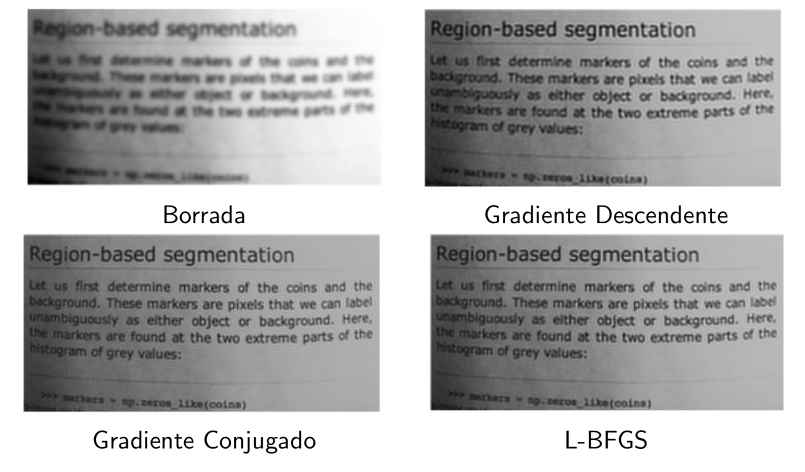

# Desborramento de Imagem (Image Deblurring)
## Autores/Contribuidores
* [Helton Wu](https://github.com/heltonwu)
* [Matheus Borges Borba dos Santos](https://github.com/MatheusBorgesBS)
* Vinicius de Oliveira Dias
##  Objetivo
Este projeto implementa e compara métodos de otimização para resolver o problema de desborramento (deblurring) de imagens, modelado como um problema de minimização de erro quadrático:

$$
\min_{x} \quad 0.5 \cdot ||Ax - b||^2
$$

Onde:
* $x$ é a imagem original (desconhecida) que estamos tentando recuperar.
* $A$ é a matriz de convolução (kernel) que representa o desfoque (blur).
* $b$ é a imagem degradada (borrada) observada.

## ⚙️ Métodos de Otimização Implementados

O notebook **unblur_image.ipynb** demonstra a aplicação e convergência dos seguintes métodos para encontrar a solução $x$:

1.  **Descida do Gradiente (Gradient Descent - GD)**: Com passo ótimo (Busca Exata).
2.  **Gradientes Conjugados (Conjugate Gradient - CGNE)**.
3.  **Quasi-Newton (L-BFGS-B)**: Utilizando a implementação da biblioteca `scipy.optimize`.

## Resultados




##  Como Rodar o Projeto

1.  **Clone o Repositório:**
    ```bash
    git clone  https://github.com/MatheusBorgesBS/Image-Deblurring-via-Quadratic-Formulation-and-Fundamental-Optimization-Methods.git
    cd desborramento-imagem
    ```

2.  **Crie e Ative um Ambiente Virtual (Recomendado):**
    ```bash
    python -m venv venv
    source venv/bin/activate  # No Linux/macOS
    # venv\Scripts\activate   # No Windows
    ```

3.  **Instale as Dependências:**
    ```bash
    pip install -r requirements.txt
    ```

4.  **Execute o Notebook:**
    Abra o arquivo `unblur_image.ipynb` em JupyterLab, VS Code ou outro ambiente compatível e execute as células.


